# Bharat Blood Bank(Rakt)

In this android app we can request our city people to donate blood or we can find blood near us.

### Screenshots

#### Splash Screen
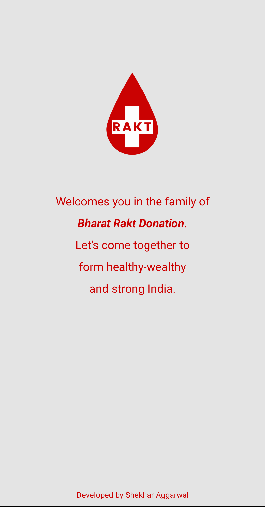

#### Home Screen
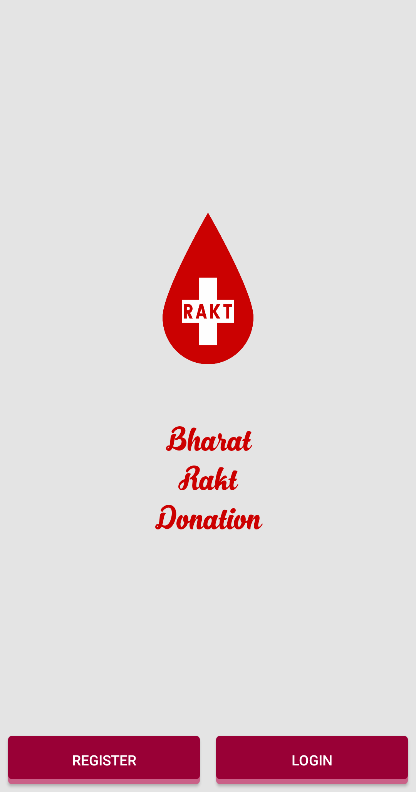

#### Register Screen
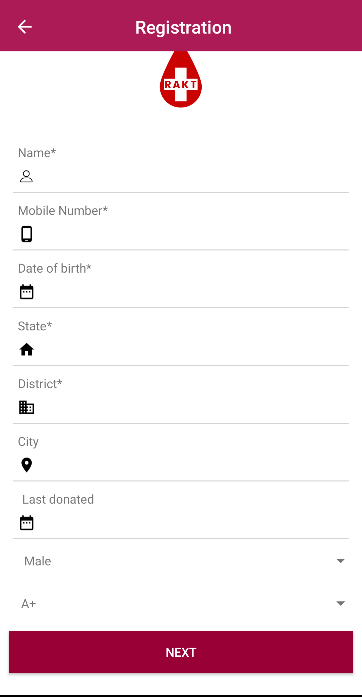

#### login Screen
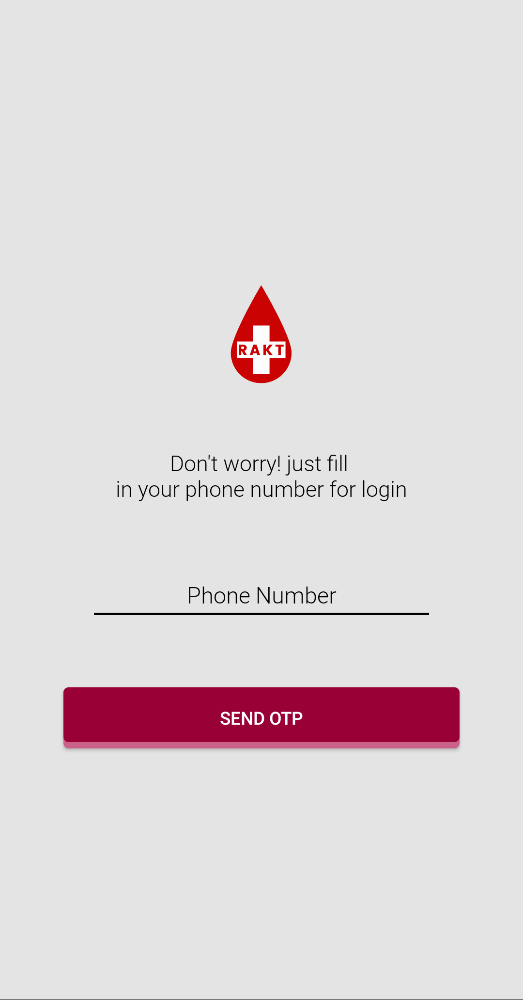

#### OTP Screen
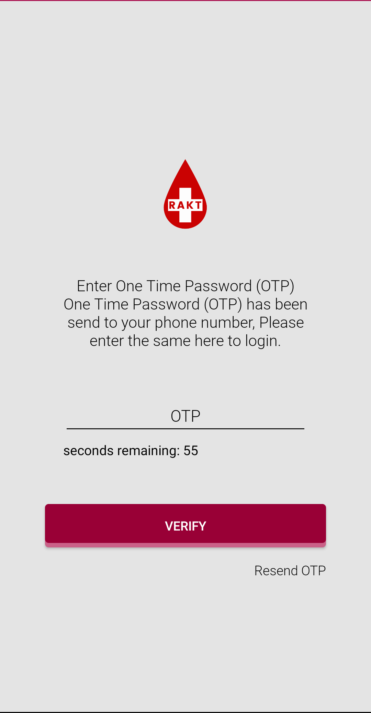

#### Dashboard Screen
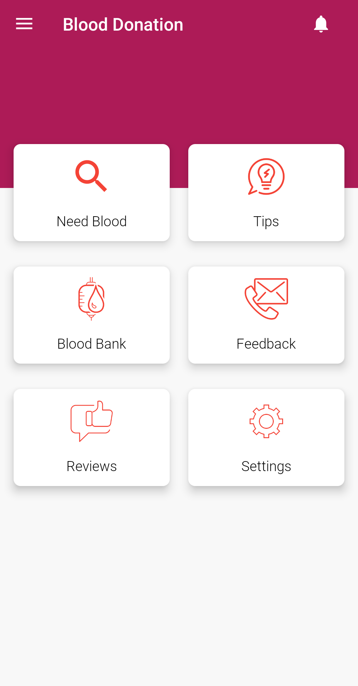 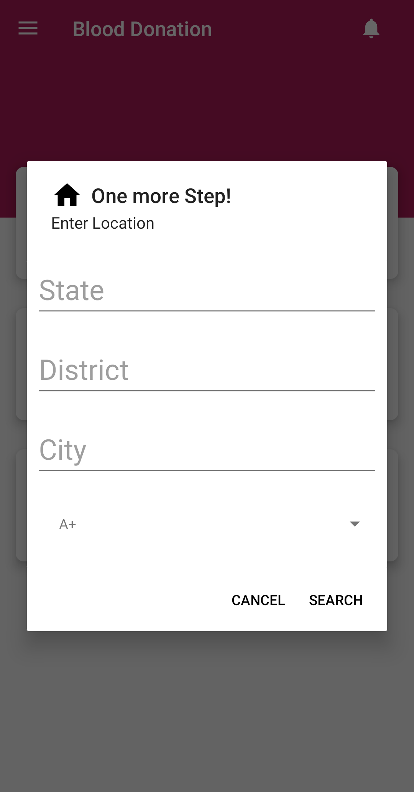 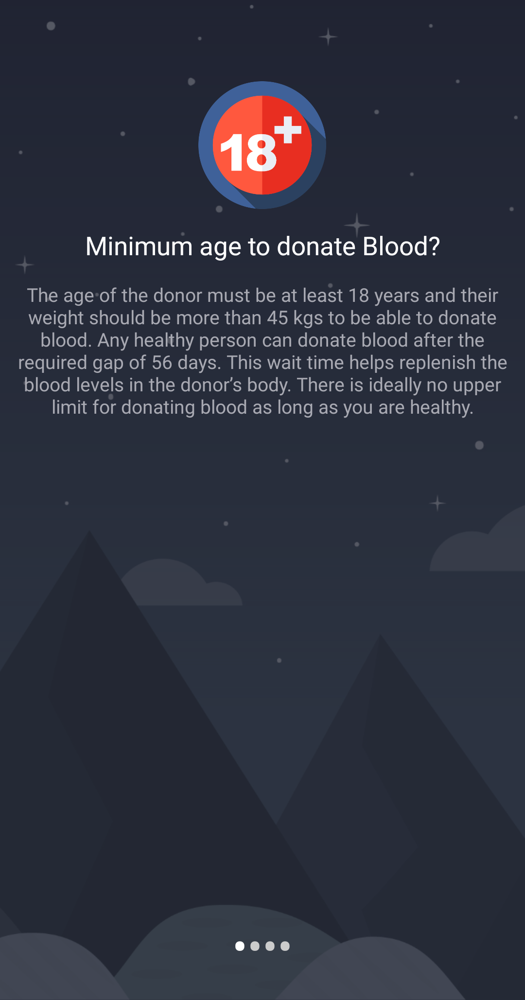 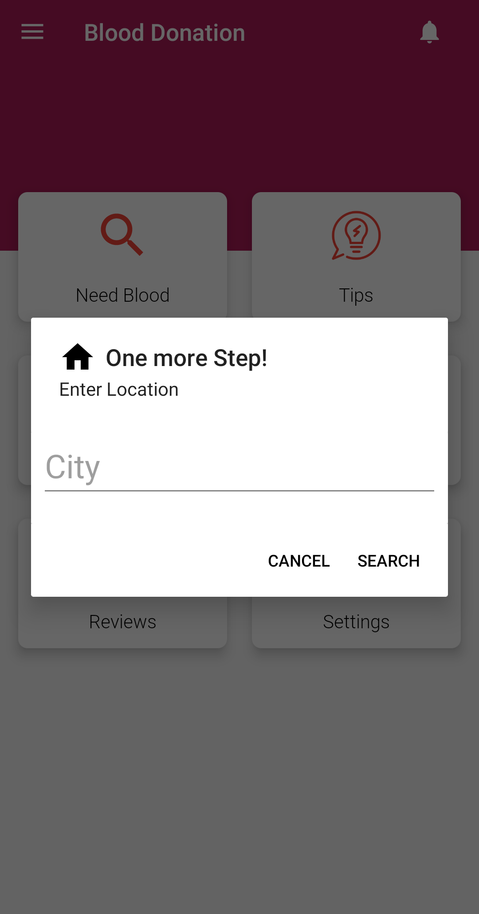

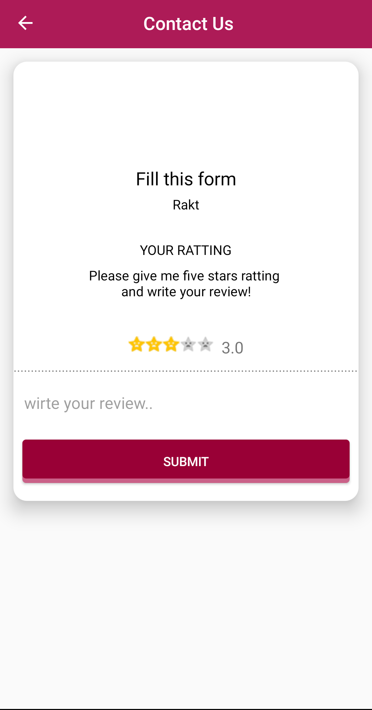 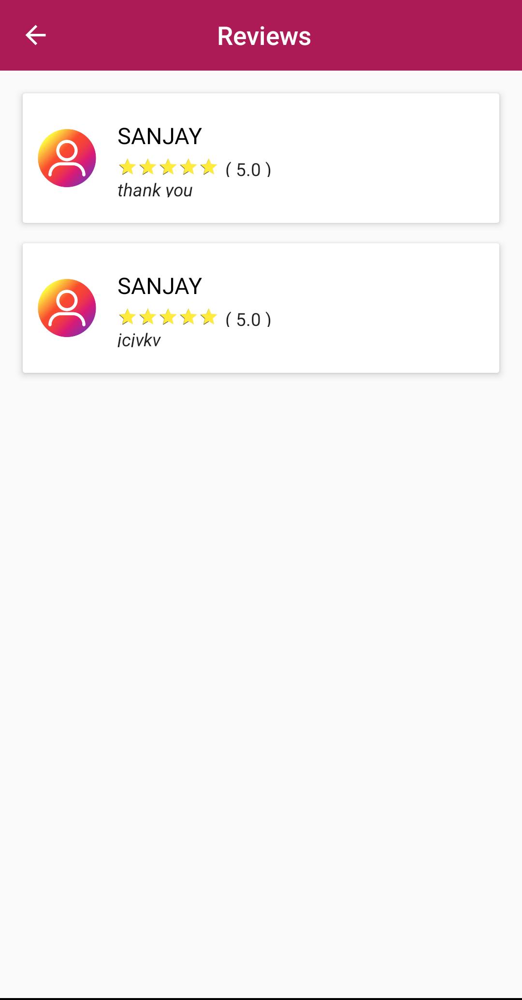 

#### Menu Screen
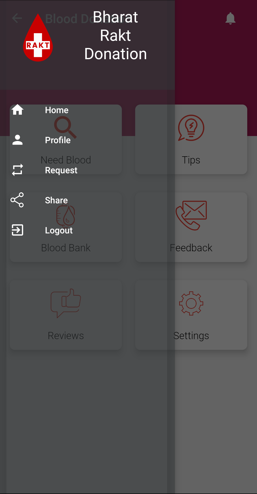

#### Profile Screen
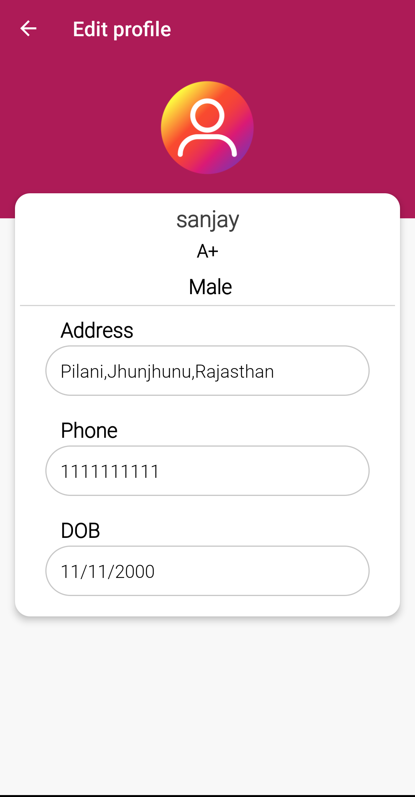

#### Request Screen
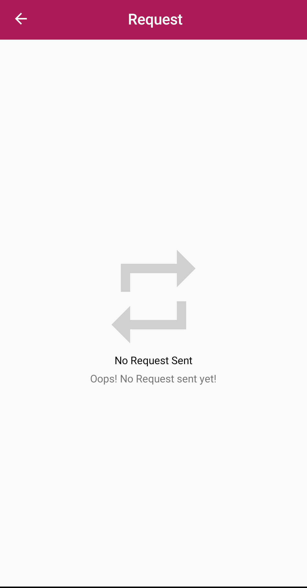 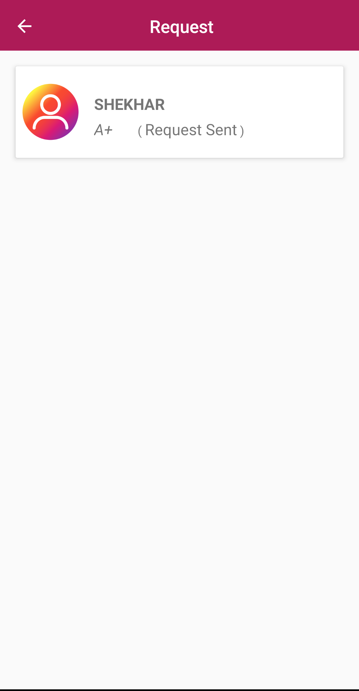 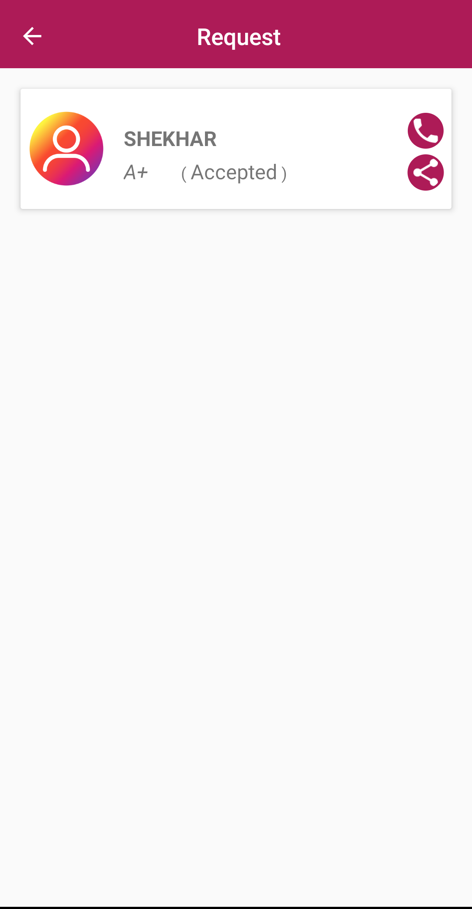

#### Notification Screen
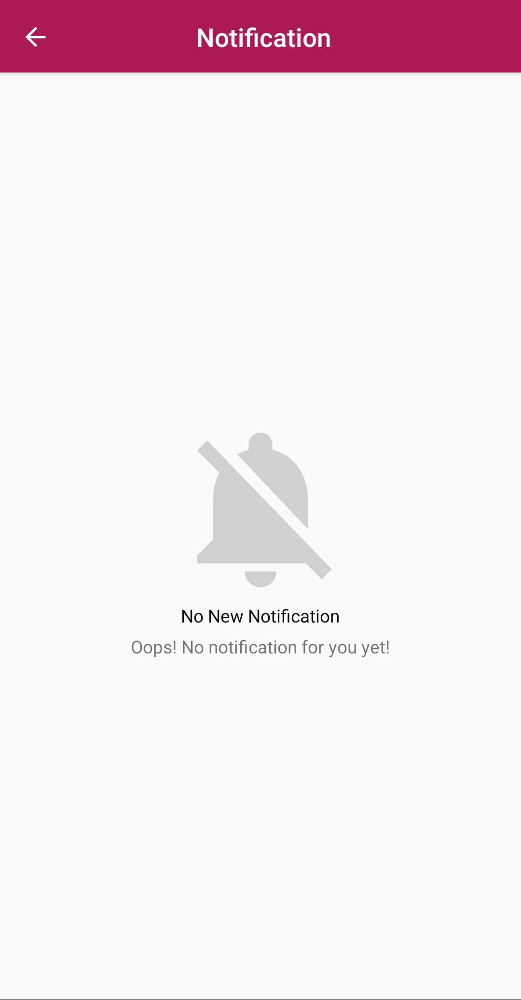 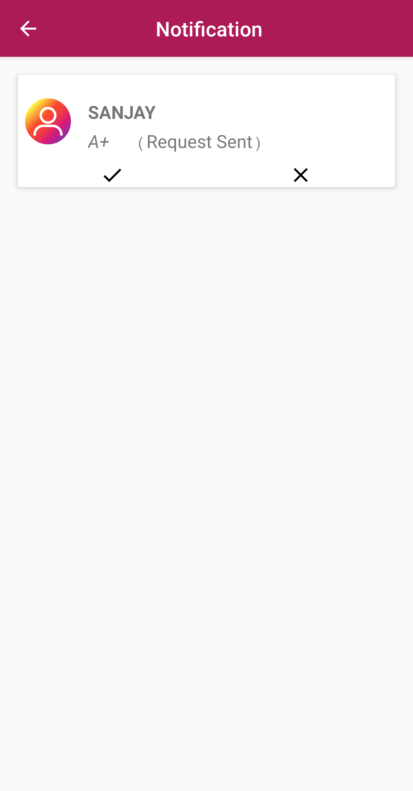 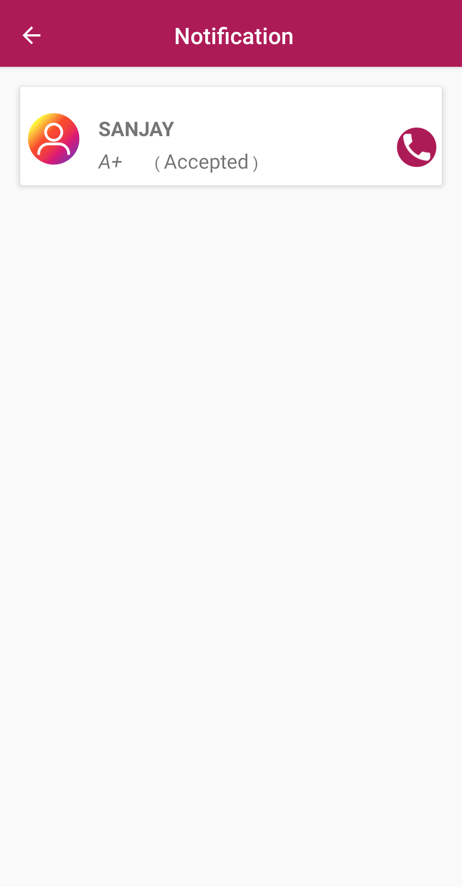

#### No Internet Screen
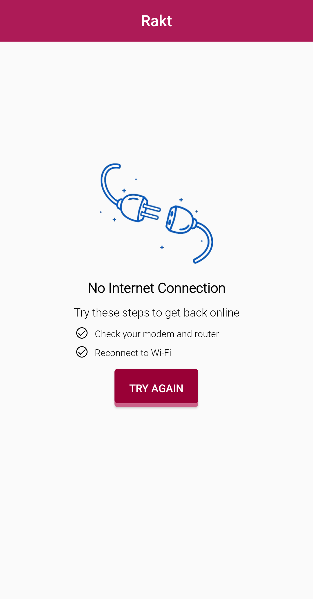

### Created & Maintained By
[Shekhar Aggarwal](https://github.com/shekharAggarwal)

# License

    Copyright 2020 Shekhar Aggarwal

    Licensed under the Apache License, Version 2.0 (the "License");
    you may not use this file except in compliance with the License.
    You may obtain a copy of the License at

       http://www.apache.org/licenses/LICENSE-2.0

    Unless required by applicable law or agreed to in writing, software
    distributed under the License is distributed on an "AS IS" BASIS,
    WITHOUT WARRANTIES OR CONDITIONS OF ANY KIND, either express or implied.
    See the License for the specific language governing permissions and
    limitations under the License.
